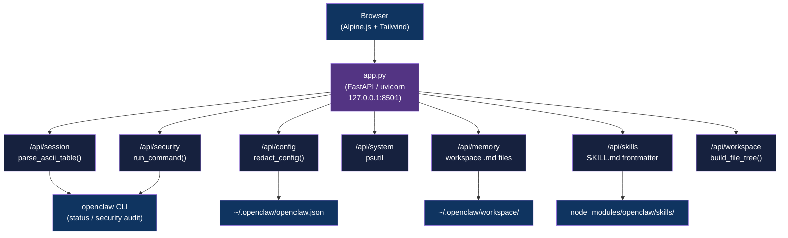

<div align="center">

# OpenClaw Dashboard

[](https://www.python.org/downloads/)
[](https://docs.astral.sh/uv/)
[](https://fastapi.tiangolo.com/)
[](https://tailwindcss.com/)
[](LICENSE)

**Observability dashboard for the OpenClaw AI agent framework: FastAPI backend, Tailwind + Alpine.js frontend, no build step**

[Getting Started](#getting-started) | [Usage](#usage) | [API Reference](#api-reference)

</div>

---

## Table of Contents

- [Features](#features)
- [Tech Stack](#tech-stack)
- [Architecture](#architecture)
- [Demo](#demo)
- [Getting Started](#getting-started)
  - [Prerequisites](#prerequisites)
  - [Installation](#installation)
  - [Configuration](#configuration)
- [Usage](#usage)
- [How It Works](#how-it-works)
- [API Reference](#api-reference)
- [Architectural Decisions](#architectural-decisions)
- [Project Structure](#project-structure)
- [Security](#security)
- [License](#license)
- [Author](#author)

## Features

- **Session Status** - live hero metric cards (model, thinking level, reasoning, active sessions) fed from `openclaw status`
- **Smart noise filtering** - automatically hides Tailscale, Node Service, Probes, and empty Events sections when irrelevant
- **Security audit view** - severity-badged findings with fix recommendations from `openclaw security audit`
- **Configuration viewer** - full `openclaw.json` display with secrets automatically redacted (token/key/auth fields masked)
- **Memory file browser** - workspace `.md` files, `SOUL.md`, `IDENTITY.md`, and daily logs with inline viewer
- **Skills grid** - installed OpenClaw skill directories with titles and descriptions parsed from `SKILL.md` frontmatter
- **System info** - real-time CPU, memory, and disk usage via `psutil` with progress bars
- **Workspace file tree** - 4-level deep directory tree with per-file size display
- **Dark glassmorphism UI** - animated mesh background, monochrome icon/value color system, skeleton loading, smooth page transitions

## Tech Stack

| Component | Technology |
|-----------|------------|
| Language | Python 3.11+ |
| Backend | FastAPI 0.115+ + uvicorn |
| Frontend | Tailwind CSS (CDN) + Alpine.js |
| System metrics | psutil |
| Data sources | `openclaw status` CLI, `openclaw security audit` CLI, `~/.openclaw/openclaw.json` |
| Package manager | uv |

## Architecture



## Demo


## Getting Started

### Prerequisites

- Python 3.11+
- [uv](https://docs.astral.sh/uv/) package manager
- OpenClaw installed and available as `openclaw` in PATH
- OpenClaw running (so `openclaw status` returns live data)

### Installation

1. Clone the repository:
   ```bash
   git clone https://github.com/adityonugrohoid/openclaw-dashboard.git
   cd openclaw-dashboard
   ```

2. Install dependencies with uv:
   ```bash
   uv sync
   ```

3. Run the dashboard:
   ```bash
   uv run python app.py
   ```

   Open `http://localhost:8501` in your browser.

### Configuration

The dashboard reads from fixed paths by default. If your OpenClaw installation is in a non-standard location, edit the constants at the top of `app.py`:

```python
OPENCLAW_BIN    = "/path/to/openclaw"
OPENCLAW_CONFIG = "/path/to/.openclaw/openclaw.json"
WORKSPACE_PATH  = "/path/to/.openclaw/workspace"
SKILLS_PATH     = "/path/to/openclaw/skills"
```

No `.env` file is required. The dashboard does not expose any user-configurable secrets of its own.

## Usage

```bash
# Start the dashboard (binds to 127.0.0.1:8501)
uv run python app.py
```

The sidebar provides navigation to: Session Status, Configuration, Memory Files, Skills, Workspace, Channels, Security, and System Info.

Each page polls the corresponding `/api/*` endpoint and renders the response live. There is no manual refresh button; use browser reload.

## How It Works

### ASCII table parsing

`openclaw status` outputs box-drawing ASCII tables (Overview, Sessions, Channels). `parse_ascii_table()` locates each table by name, strips `┌ ├ └` separator lines, and zips column headers with cell values to produce a list of dicts. The parsed dicts feed the Session Status hero cards and the active sessions table.

### Noise filtering

The raw `openclaw status` output includes conditional rows for Tailscale, Node Service, Probes, Events, and Agents that are irrelevant when those features are off. The frontend Alpine.js layer inspects each field and hides rows that match known empty-state strings (`no bootstraps`, `unavailable`, `skipped`), keeping the UI clean.

### Secret redaction

`redact_config()` walks `openclaw.json` recursively. Any key whose name contains `token`, `key`, `secret`, `password`, `auth`, or `api` has its string value truncated to `first4...last4` (or `***` for short values). The redacted object is returned by `/api/config`; the raw file is never served.

### Security audit parsing

`/api/security` runs `openclaw security audit` and walks the output line-by-line looking for `CRITICAL`, `WARN`, and `INFO` severity markers. Each marker triggers collection of the following indented block as finding ID, title, description, and `Fix:` recommendation.

## API Reference

All endpoints return JSON. No authentication is required (localhost-only binding).

| Method | Endpoint | Description |
|--------|----------|-------------|
| `GET` | `/` | Serve `static/index.html` (SPA entry point) |
| `GET` | `/api/session` | Parsed `openclaw status`: overview, sessions, channels, security summary |
| `GET` | `/api/config` | Redacted `openclaw.json` organized by section |
| `GET` | `/api/memory` | Workspace `.md` files and daily log listing with content |
| `GET` | `/api/skills` | Installed skills with `SKILL.md` frontmatter |
| `GET` | `/api/workspace` | 4-level file tree of `~/.openclaw/workspace/` |
| `GET` | `/api/channels` | Channel config from `openclaw.json` with DM scope |
| `GET` | `/api/security` | Parsed `openclaw security audit` findings with severity counts |
| `GET` | `/api/system` | CPU percent, memory, disk usage via psutil |

### Example

```bash
curl http://localhost:8501/api/session | jq '.config_info'
```

```json
{
  "model": "claude-opus-4-5",
  "thinking": "auto",
  "reasoning": "On",
  "dm_scope": "all",
  "compaction": "auto"
}
```

## Architectural Decisions

### 1. Single-file SPA with CDN assets

**Decision:** All backend logic lives in `app.py`. Frontend uses Tailwind CSS from CDN and Alpine.js from CDN, served as a static `index.html`.

**Reasoning:** Eliminates the npm build pipeline entirely. No `node_modules`, no bundler, no compile step. For a localhost-only personal tool, CDN latency is irrelevant and the reduced setup friction matters.

### 2. Localhost-only binding (127.0.0.1)

**Decision:** `uvicorn` is bound to `127.0.0.1:8501`, not `0.0.0.0`.

**Reasoning:** Browser security extensions flag `0.0.0.0` as a potential SSRF surface. Localhost-only binding avoids that and is appropriate for a personal observability tool with no authentication layer.

### 3. CLI invocation over IPC

**Decision:** Session and security data are fetched by shelling out to `openclaw status` and `openclaw security audit` via `subprocess.run`, then parsing ASCII output.

**Reasoning:** OpenClaw does not expose a stable programmatic API. Parsing the CLI output is the only integration point available without forking the framework. A 15-second timeout guards against stalled commands.

### 4. Redact-on-read for config display

**Decision:** Config secrets are redacted in the API layer (`redact_config()`), not in the frontend.

**Reasoning:** Never serving raw secret values to the browser, even on localhost, means accidental browser history or DevTools captures cannot leak credentials.

## Project Structure

```
openclaw-dashboard/
├── app.py                  # FastAPI server: all endpoints + parsing logic
├── static/
│   ├── index.html          # SPA entry point (Alpine.js + Tailwind CDN)
│   └── favicon.ico
├── screenshots/
│   ├── session-status-top.png
│   ├── session-status-bottom.png
│   └── system-info.png
├── pyproject.toml          # Project metadata + uv dependencies
└── uv.lock                 # Locked dependency graph
```

## Security

- **Secret redaction** - `openclaw.json` keys matching `token`, `key`, `secret`, `password`, `auth`, or `api` are masked before serving. Raw config is never returned.
- **Localhost-only** - the server binds to `127.0.0.1`. No auth layer is implemented because no external network exposure is intended.
- **No inbound user input** - all endpoints are read-only `GET` requests; no user-supplied data reaches the filesystem or the CLI.

## License

This project is licensed under the [MIT License](LICENSE).

## Author

**Adityo Nugroho** ([@adityonugrohoid](https://github.com/adityonugrohoid))
