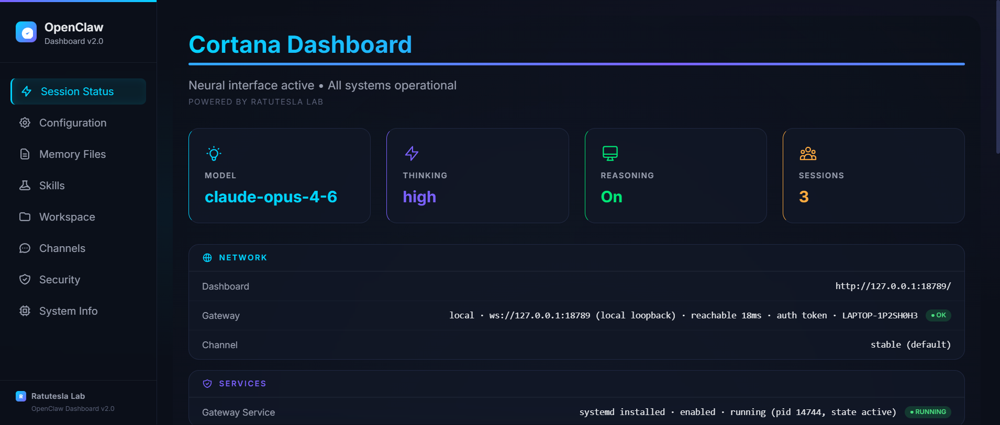
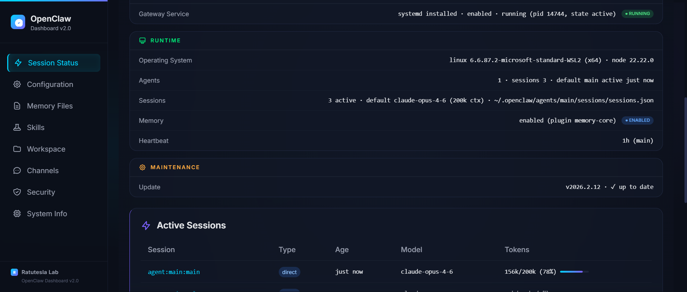
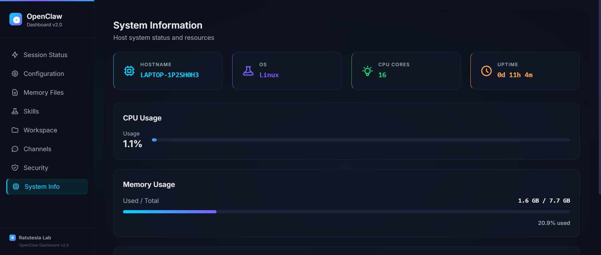

# OpenClaw Dashboard

A custom-built observability dashboard for [OpenClaw](https://github.com/openclaw/openclaw) — the autonomous AI agent framework. Provides real-time visibility into agent configuration, sessions, security posture, and system resources through a premium dark-mode interface.







## Stack

| Layer | Technology |
|-------|-----------|
| **Backend** | FastAPI + uvicorn |
| **Frontend** | Tailwind CSS (CDN) + Alpine.js |
| **Data** | OpenClaw CLI (`openclaw status`, `openclaw security audit`) + config JSON |
| **Package Manager** | uv |

Single-file SPA — no build step, no bundler, no node_modules.

## Features

### Session Status
- **Hero metric cards** — Model, Thinking Level, Reasoning, Active Sessions with monochrome color system
- **System Overview** — Sectioned list layout (Network · Services · Runtime · Maintenance) with monochrome SVG icons and status pills
- **Active Sessions** — Table with token usage progress bars
- **Channels & Security** — Side-by-side summary cards with colored status indicators

### Smart Data Filtering
The dashboard automatically hides irrelevant noise from `openclaw status` output:
- Tailscale → hidden when off
- Node Service → hidden when not installed
- Probes → hidden when skipped
- Events → hidden when none
- Agents → strips "no bootstraps" filler
- Update → transforms to `v2026.x.x · ✓ up to date`
- Memory → strips "unavailable" probe noise
- IP/hostname noise → filtered from Gateway row

### Additional Pages
- **Configuration** — Full config viewer with JSON syntax highlighting and redacted secrets
- **Memory Files** — Browse workspace `.md` files and daily logs with inline viewer
- **Skills** — Grid of installed OpenClaw skills with descriptions
- **Workspace** — File tree with sizes
- **Channels** — Channel config details (DM policy, group policy, allowFrom)
- **Security** — Full audit findings with severity badges and fix recommendations
- **System Info** — CPU, memory, disk usage with progress bars

### Design
- Glassmorphism cards with animated mesh background
- Monochrome color system — each card's icon and value share a single static color
- Custom scrollbar, skeleton loading states, smooth page transitions
- Responsive sidebar navigation
- Bound to `127.0.0.1` (localhost only — safe for extensions that flag `0.0.0.0`)

## Quick Start

```bash
# Clone
git clone https://github.com/adityonugrohoid/openclaw-dashboard.git
cd openclaw-dashboard

# Install dependencies (requires uv)
uv sync

# Run
uv run python app.py
# → http://localhost:8501
```

### Requirements
- Python 3.12+
- [uv](https://docs.astral.sh/uv/) package manager
- OpenClaw installed and running (`openclaw` CLI available in PATH)

## Configuration

The dashboard reads from:
- `~/.openclaw/openclaw.json` — Agent config (redacted in UI)
- `~/.openclaw/workspace/` — Memory files and workspace structure
- `openclaw status` — Live session and system status
- `openclaw security audit` — Security findings

Update paths in `app.py` if your OpenClaw installation differs.

## Author

**Adityo Nugroho** · [GitHub](https://github.com/adityonugrohoid) · [Portfolio](https://adityonugrohoid.github.io)

Built at **Ratutesla Lab**

## License

MIT
